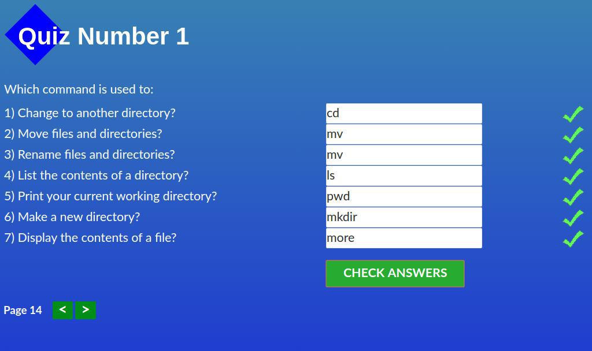
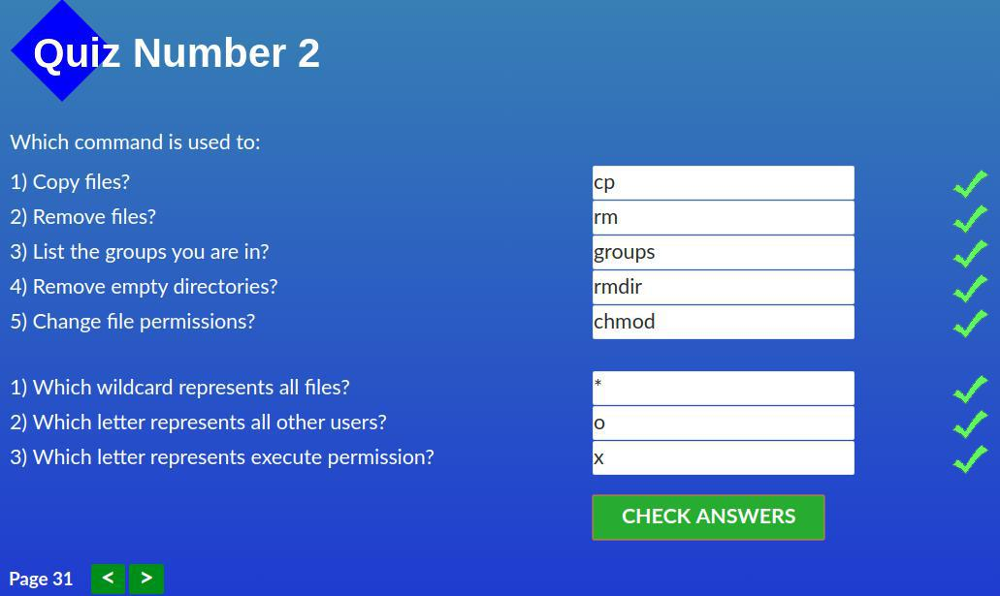
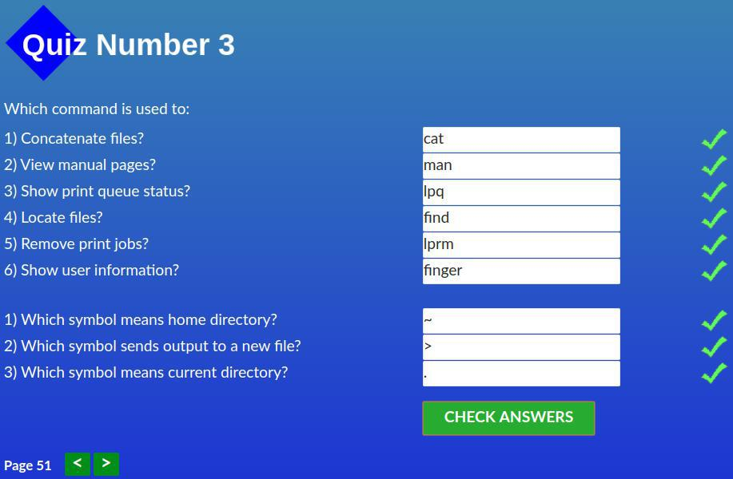
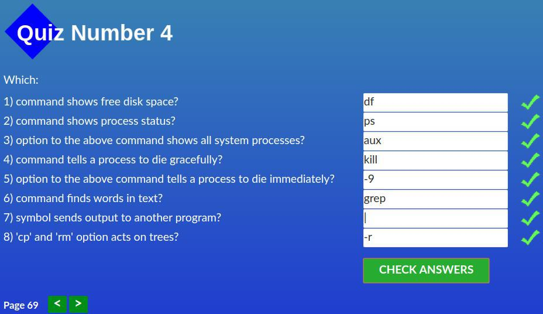
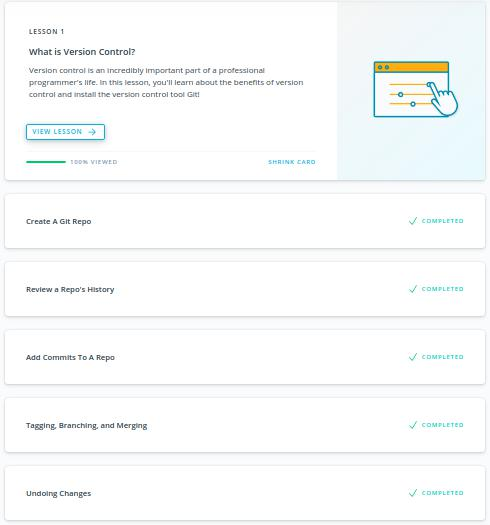
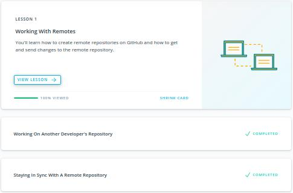

## Linux CLI, and HTTP
**Reflections

> In this topic i learned a lot of new features for me!
> Especially in module 4. It`s very interesting and useful commands which you need know if you want to be a programmer.

**Screenshots:

## Git Collaboration
**Reflections

> In this course I have learned many opportunities of GIT.
> The most powerful command was git rebase.
> I think it`s one of the most useful command which exist in GIT.
> Also i learned more new about remote repository, for instance star, watch.

**Screenshots:

